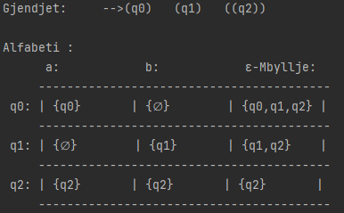
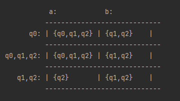

# Projekt - Teori gjuhesh

### Përshkrimi:
Programi shërben për koverimin e Automatëve.
### 📕 ε-AFJD -> AFJD -> AFD -> AFD(minimizim)

Merr si input në console nga përdoruesi :
- Numrin e gjëndjeve,
- Emrin e secilës gjëndje,
- Per secilen gjëndje merret nëse është ose jo fillestare apo fundore,
- Numrin e shkronjave,
- Emrin e secilës shkronjë
- Tranzicionet .

Afishon ne Console :

- Per automatin e konvertuar : gjëndjet 'fillestare dhe fundore'.
- Tabelen me tranzicionet për automatin që konvertohet.

Konvertimi në ε-AFJD -> AFJD

Konvertimi në AFJD -> AFJD

#### Gjuha e përdorur për ndërtimin e programit:
Java SE17  

Për te bëre:
1. Afd -> Afd(minimizim)

Contact me:  [ardit.sokoli@ap.edu.al](mailto:ardit.sokoli@ap.edu.al?subject=[GitHub]%20Source%20Han%20Sans)